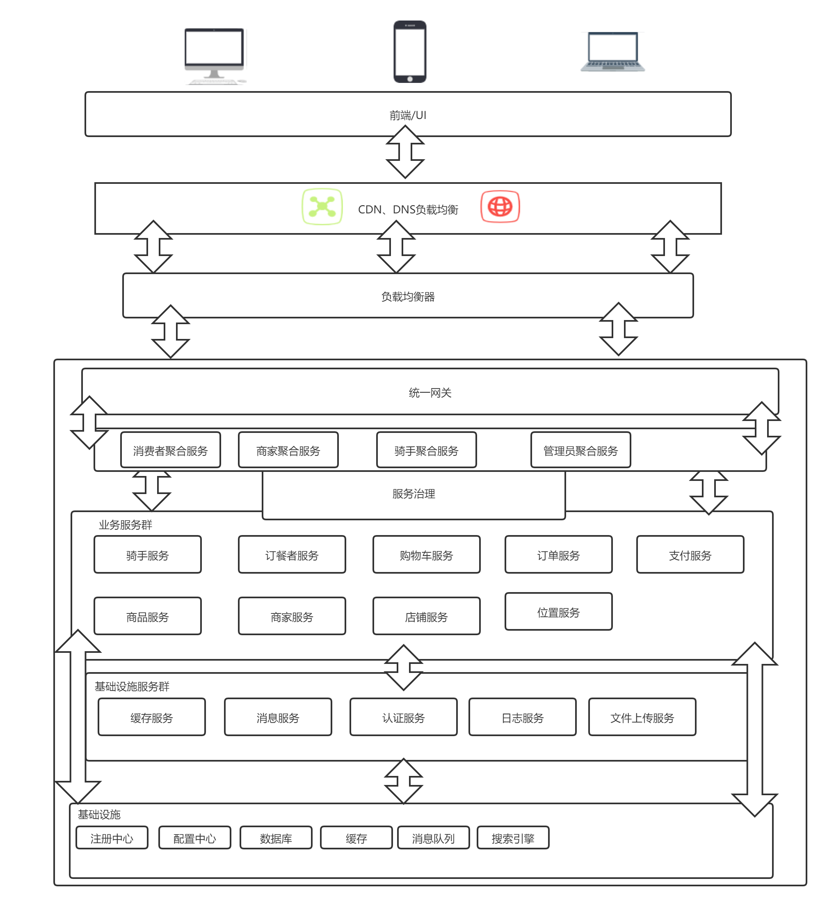

# 饱了吧外卖订餐系统

- 站在系统设计者的角度从零开始构建一个外卖订餐系统

## 计划

- ~~需求分析~~
- ~~边界划分~~
- ~~架构设计~~
- 后端开发
  - ~~接口设计~~
  - ~~基础设施服务开发~~
  - 业务服务开发
    - ~~购物车服务~~
    - ~~商品服务~~
    - ~~订餐者服务~~
    - ~~店铺服务~~
    - ~~订单服务~~
    - ~~骑手服务~~
    - ~~支付服务~~
    - 商家服务
    - 位置服务
- 前端开发
  - 消费者前端
    - ~~页面设计~~
    - 业务逻辑开发
  - 商家前端
    - 页面设计
    - 业务逻辑
  - 骑手前端
  - 管理系统
- 前后端联调
- 部署运维
- 尝试优化
- 结束

## 技术架构

## 技术栈

### 后端

#### 基础设施

- 容器管理：docker
- 数据库：mysql
- 注册中心/配置中心：nacos
- 消息队列：rabbitmq
- 文件服务器：fastdfs

#### 框架

- 微服务框架：spring cloud
- 单元测试
  - junit5
  - mockito
  - spring boot test
  - h2
- 文档管理：swagger
- 服务调用：open feign
- 服务熔断/降级：alibaba sentinel

#### 运维

- 持续集成：github action

### 前端

- 包管理：npm
- 项目结构：vue cli
- 打包：webpack
- 框架：vue
  - vuex
  - vue router
- ui框架：element ui
- css loader：less
- 地图组件：amap
- ajax：axios
- 单元测试：jest