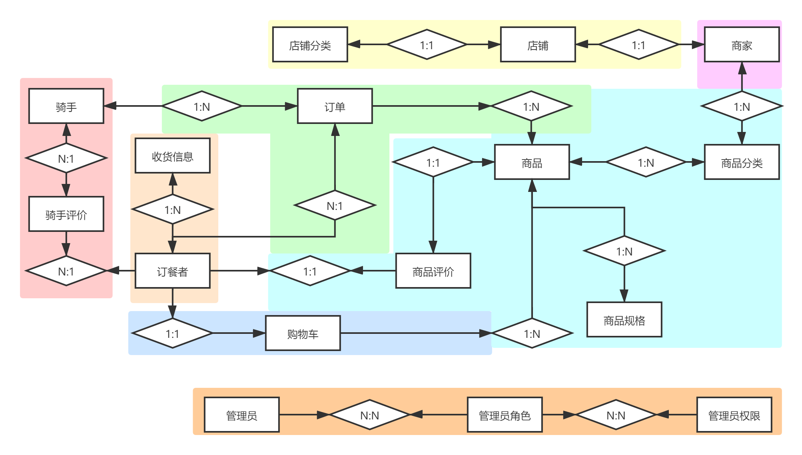

# 系统分析

## 角色

- 订餐者
- 商家
- 骑手
- 管理人员

## 实体

跟角色相关的实体

### 订餐者

- 订餐者
- 位置
- 店铺分类
- 店铺
- 商家
- 商品分类
- 商品
- 商品规格
- 商品评价
- 购物车
- 订单
- 收货信息
- 骑手
- 骑手评价

### 商家

- 商家
- 店铺分类
- 店铺
- 商品分类
- 商品
- 商品规格
- 商品评价
- 订单

### 骑手

- 骑手
- 订单
- 订餐者
- 商家
- 骑手评价

### 管理员

- 管理员
- 管理员角色
- 管理员权限

## 系统边界划分

